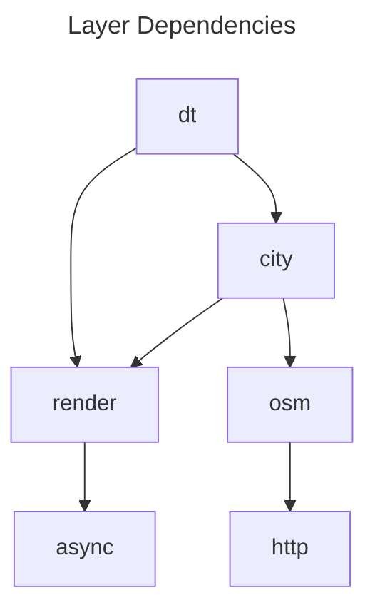

# Design
The design of the software is based on layers, where each layer is responsible for some functionality and usually manages its own memory. 

## dt
This is the top level application layer and contains the main loop that creates a new frame each iteration. Each iteration the state of the simulation is updated, and the state can be used to update the geometry to display.
This layer also manages the input from the command line. At the moment, only bounding box coordinates in WGS84 can be provided as input.

## city 
This layer contain the state of static and dynamic objects in the application. At the moment this is buildings, roads and cars. The static state of the application (buildings and roads) are currently fetched through the osm layer.

## osm
The osm layer manages the state fetched from OpenStreetMap.

## http 
All http calls go through this layer. At the moment this is just a application wrapper around a OS specific way of creating http calls. 

## render 
This is the layer responsible for rendering and displaying images. It wraps the Vulkan graphics API and provides an interface for batching draw calls and thereby decreasing the numbers.

## async
Implements a job system using a thread safe FIFO queue. It is currently used by the render layer to stream textures.

# Manual Memory Management
One important difference between this project and an usual C++ project is in the way memory is managed. This project does heavy use of memory arenas which is an important concept to become familiar. The overall idea is to simplify memory management by decreasing the number of memory allocations by bundling smaller allocations together that has the same lifetime so that only a single deallocation is need. 
This way of handling resources is a common way of handling memory high performance applications like game engines, where performance is critical and manual memory management is necessary.
There are resources out there that explains the usage in more detail. 
These are examples:
* https://www.youtube.com/watch?v=TZ5a3gCCZYo&t=4s
* https://www.rfleury.com/p/untangling-lifetimes-the-arena-allocator
* Project usage: https://github.com/EpicGamesExt/raddebugger
