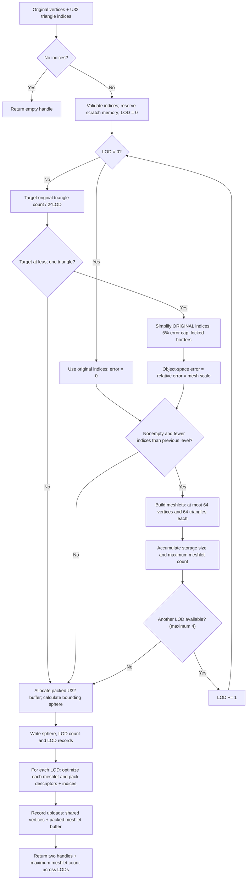
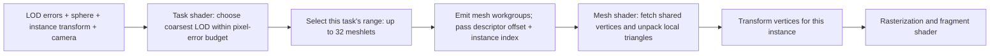

# Meshlet LOD

Agent models build up to four discrete LODs during `mesh_shader_handles_create_and_upload`.
Each level is simplified from the original indices with meshoptimizer, targeting
100%, 50%, 25%, and 12.5% of the triangle count. A 5% object-relative geometric
error cap and locked borders may prevent reaching these targets. Levels that
do not reduce the triangle count are omitted. All levels share the original
vertices; each has its own meshlets and local triangle indices.

## Build and upload algorithm

This runs once per mesh upload, not once per frame or instance.



For LOD 0, the previous index count is initialized to `indices.size + 1`, so
the original nonempty mesh passes the reduction check. Upload completion is
asynchronous; returning the handles does not mean the GPU upload has finished.

## GPU layout

The meshlet storage buffer uses U32 words:

- Words 0–3: object-space bounding sphere (float bits).
- Word 4: number of LODs; words 5–7 reserved.
- Words 8–23: four LOD records, each `[descriptor_offset, meshlet_count, error_bits, reserved]`.
- Remaining words: each level's meshlet descriptors and packed index data.

### Candidate LOD fields

`candidate` is the zero-based LOD index, not a meshlet index. Its record starts
at word `8 + candidate * 4`; only records below the LOD count in word 4 are valid.

| Word offset | Field | Meaning |
|---|---|---|
| `8 + candidate * 4` | `descriptor_offset` | Absolute U32-word offset into `meshlet_words` where this LOD's meshlet descriptors begin. |
| `9 + candidate * 4` | `meshlet_count` | Number of meshlets in this LOD, not its vertex or triangle count. |
| `10 + candidate * 4` | `error_bits` | Raw bits of the object-space simplification error relative to the original mesh. Decode with `uintBitsToFloat`; this is not yet an error in pixels. LOD 0 has zero error. |
| `11 + candidate * 4` | `reserved` | Unused word, currently zero. |

For example, candidate 1 uses words 12–15, with its error at word 14.
The task shader converts that error to pixels using the instance's transform
stretch, camera projection scale, and nearest depth, then compares it with
`lod_error_pixels`. Selection starts at LOD 0 and tests the coarser candidates.

Descriptor offsets are absolute word offsets. Meshlet descriptors remain
`[vertex_reference_offset, triangle_offset, vertex_count, triangle_count]`.

```text
meshlet_words (one word = one U32 = 32 bits = 4 bytes)
│
├─ Words 0–7   Sphere + LOD count + reserved
├─ Words 8–23  LOD records (four words each)
│                descriptor_offset ──────────────┐
├─ LOD 0                                        │
│  ├─ All meshlet descriptors ◄──────────────────┘
│  │    [vertex_reference_offset, triangle_offset, vertex_count, triangle_count]
│  ├─ Meshlet 0 vertex references ─────────────────► Shared vertex buffer
│  ├─ Meshlet 0 packed local triangle indices
│  ├─ Meshlet 1 vertex references
│  ├─ Meshlet 1 packed local triangle indices
│  └─ ...
├─ LOD 1: descriptors, then each meshlet's references and triangles
└─ ...remaining LODs

Triangle lookup:
packed triangle word → three local indices → vertex references → actual vertices

Example:
0x00020100 → [0, 1, 2] → [42, 17, 93] → vertices[42], vertices[17], vertices[93]
```

Sphere coordinates and LOD errors are float **bits** stored in U32 words;
the shaders reinterpret them with `uintBitsToFloat`.

## Selection

`MeshInstanceBatch::lod_error_pixels` sets the projected geometric-error budget.
Zero forces LOD 0; agents currently use 1 pixel. The task shader chooses the
coarsest eligible LOD using viewport height, projection scale, distance to the
nearest part of the bounding sphere, and a conservative transform stretch bound.
Instances intersecting the camera plane retain full detail.

Each task group handles up to 32 meshlets for one instance and emits only mesh
workgroups belonging to its chosen LOD. Dispatch dimensions use task-stage limits;
the mesh shader receives the selected descriptor and instance through its payload.
Both `taskShader` and `meshShader` are required.



This takes inspiration from the screen-space-error approach in
[vk_lod_clusters](https://github.com/nvpro-samples/vk_lod_clusters), but is not its
continuous cluster hierarchy. There is no streaming, transition blending,
hysteresis, or meshlet occlusion culling. LODs switch discretely. Simplification
preserves indexed borders/seams but does not bound texture-space error. Levels
are selected per material primitive, not as a single whole-model hierarchy.
