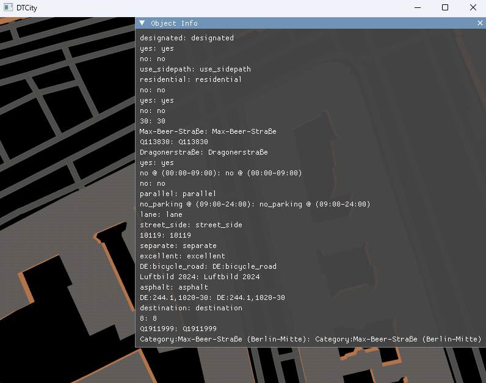

# Usage Guide

The program renders a selected area of the Earth's surface in 3D showing roads and buildings created from OpenStreetMap data. 
WGS84 coordinates (longitude/latitude) can be provided as command-line arguments or the executable can be run without any input. In the latter case, default coordinates will be used.
The area of the bounding box is defined by two corners:

* p0 - lower-left corner (south-west)
* p1 - upper-right corner (north-east)

Each corner is given as longitude followed by latitude (in decimal degrees).
```
From bash on linux
./city lon_p0 lat_p0 lon_p1 lat_p1 
From cmd.exe in windows
.\city lon_p0 lat_p0 lon_p1 lat_p1 
```

example in bash on linux (make sure to be in the working directory of the executable):
```
./city 13.388860 52.517037 13.428055 52.539674
```

A windows will not be created and you should have the following view pop up:



Caution!
Keep the bounding box to an area that is less than 1 square kilometer to avoid long loading times.
The application does not currently implement any form of culling. 

### Windows 
To run the executable in windows it might be necessary to unblock the file for security reasons. This is done by right clicking the executable then go to properties and checkthe box saying "Unblock" at the bottom. You should now be able to run the executable.

## Controls

It is possible to navigate the 3D visualization using the following controls:

Movement: WASD keys (first-person style)
* W - forward
* S - backward
* A - left
* D - right

Look around: Hold the left mouse button and move the mouse 

Road information: Hover the mouse cursor over a road to display available details (e.g road name), provided the data exists in OpenStreetMap.
